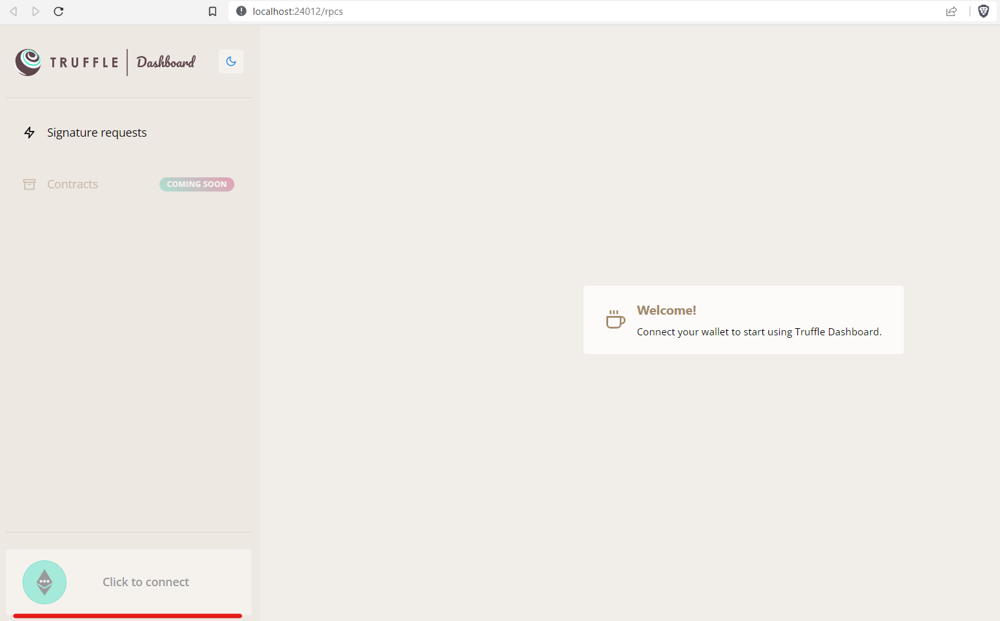
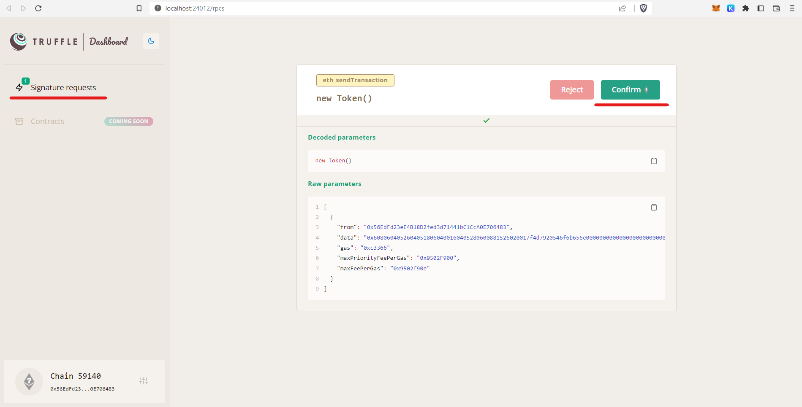
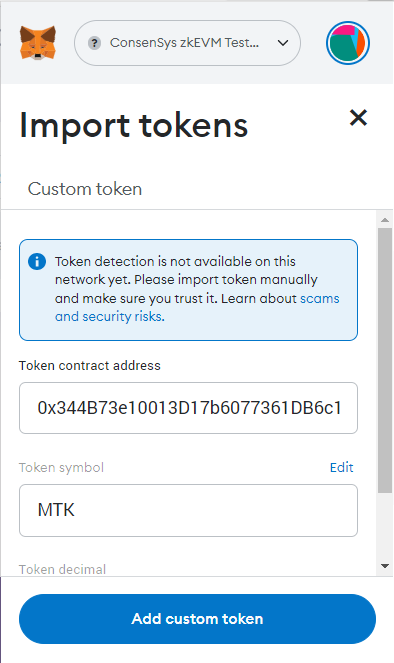

## Деплой смарт контракта на ZK EVM

- Понадобится [nodejs v14-v18](https://trufflesuite.com/docs/truffle/how-to/install/#install-nodejs)

- Ставим truffle

  `npm install -g truffle`

- Проверяем версию

  `truffle version`

  ```
  Truffle v5.7.7 (core: 5.7.7)
  Ganache v7.7.5
  Solidity - 0.8.18 (solc-js)
  Node v16.19.0
  Web3.js v1.8.2
  ```

- Создаем каталог для контракта

  `mkdir myToken; cd myToken`

- В каталоге инициализируем пустой трюфель

  `truffle init`

  ```
  Init successful, sweet!
  
  Try our scaffold commands to get started:
    $ truffle create contract YourContractName # scaffold a contract
    $ truffle create test YourTestName         # scaffold a test
  
  http://trufflesuite.com/docs
  ```

- В каталоге `contracts` создаем файл `Token.sol` следующего содержания:

  ```solidity
  pragma solidity 0.8.18;
  
  // SPDX-License-Identifier: MIT
  
  contract Token {
    string public name = "My Token"; // задаем имя своего токена
    string public symbol = "MTK"; // указываем свой тикер
    uint8 public decimals = 18;
    uint256 public totalSupply = 100000000;
  
    mapping (address => uint256) public balances;
    address public owner;
  
    constructor() public {
      owner = msg.sender;
      balances[owner] = totalSupply;
    }
  
    function transfer(address recipient, uint256 amount) public {
      require(balances[msg.sender] >= amount, "Insufficient balance.");
      balances[msg.sender] -= amount;
      balances[recipient] += amount;
    }
  }
  ```

- В терминале выполняем

    `truffle compile`

    ```
    Compiling your contracts...
    ===========================
    > Compiling .\contracts\Token.sol
    > Compilation warnings encountered:
    
        Warning: Visibility for constructor is ignored. If you want the contract to be non-deployable, making it "abstract" is sufficient.
      --> project:/contracts/Token.sol:14:3:
       |
    14 |   constructor() public {
       |   ^ (Relevant source part starts here and spans across multiple lines).
    
    
    > Artifacts written to C:\Users\theryss\Desktop\consensys\roadz\build\contracts
    > Compiled successfully using:
       - solc: 0.8.18+commit.87f61d96.Emscripten.clang
    ```

- В каталоге `migrations` создаем файл `1_deploy_token.js` следующего содержания:

  ```javascript
  const Token = artifacts.require("Token");
  
  module.exports = function (deployer) {
    deployer.deploy(Token);
  };
  ```

  Задеплоить контракт на трюфеле можно двумя способами, воспользуемся вариантом с дашбордом.

  - [настраиваем](https://docs.zkevm.consensys.net/get-started/configure-metamask) сеть ConsenSys zkEVM в MetaMask

  - запускаем дашборд трюфеля

    `truffle dashboard`

    ```
    Truffle Dashboard running at http://localhost:24012
    DashboardProvider RPC endpoint running at http://localhost:24012/rpc
    ```

  - В браузере коннектим MM 

    

  - Открываем второй терминал и запускаем деплой:

    `truffle migrate --network dashboard`

    ```
    Compiling your contracts...
    ===========================
    > Compiling .\contracts\Token.sol
    > Compilation warnings encountered:
    
        Warning: Visibility for constructor is ignored. If you want the contract to be non-deployable, making it "abstract" is sufficient.
      --> project:/contracts/Token.sol:14:3:
       |
    14 |   constructor() public {
       |   ^ (Relevant source part starts here and spans across multiple lines).
    
    
    > Artifacts written to C:\Users\theryss\Desktop\consensys\roadz\build\contracts
    > Compiled successfully using:
       - solc: 0.8.18+commit.87f61d96.Emscripten.clang
    
    
    Starting migrations...
    ======================
    > Network name:    'dashboard'
    > Network id:      59140
    > Block gas limit: 30000000 (0x1c9c380)
    
    
    1_deploy_token.js
    =================
    
       Deploying 'Token'
       -----------------
    _ Waiting for transaction signature. Please check your wallet for a transaction approval message.
    ```

    - Видим что требется апрув, апрувим в дашборде

      

    - Итоговая картина в терминале:

      ```
      1_deploy_token.js
      =================
      
         Deploying 'Token'
         -----------------
         > transaction hash:    0x4645ca97a8bab8700a1da7f01fb38804a72f342287e02f3dafb23a2b876ef925sage.
         > Blocks: 16           Seconds: 180
         > contract address:    0x344B73e10013D17b6077361DB6c14626C075D17A
         > block number:        129191
         > block timestamp:     1677159021
         > account:             0x56EdFd23eE4B18D2fed3d71441bC1CcA0E706483
         > balance:             0.002003619977610136
         > gas used:            639672 (0x9c2b8)
         > gas price:           2.500000007 gwei
         > value sent:          0 ETH
         > total cost:          0.001599180004477704 ETH
      
         > Saving artifacts
         -------------------------------------
         > Total cost:     0.001599180004477704 ETH
      
      Summary
      =======
      > Total deployments:   1
      > Final cost:          0.001599180004477704 ETH
      ```

    - Проверить деплой можно в [эксплорере](https://explorer.goerli.zkevm.consensys.net/) либо в МетаМаске сделать импорт токена по адресу контракта из вывода выше

      

    - Баланс контракта нулевой, очевидно нужен минт, продолжение следует .. 

